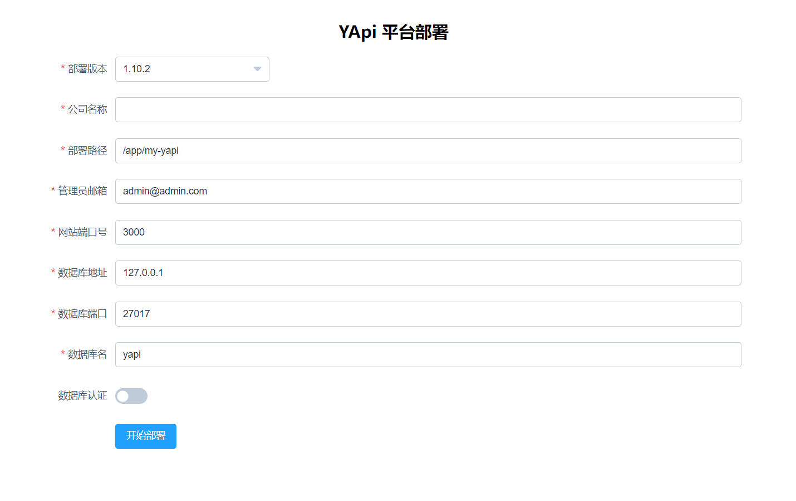

# 背景

找来找去都没找到简单方便的部署yapi到k8s的教程，就自己写了个；

**本教程部署的版本是: 1.10.2** 


# 部署步骤

克隆仓库：

```
git clone https://github.com/gebiWangshushu/hei-yapi-k8s-deploy.git
```


## 第一步 部署MongoDB

> 如果已有MongoDB请跳过这步

## 先创建命名空间

```
kubectl create ns yapi
```


## 创建pv的Secret

```
kubectl create secret generic mongo-azure-secret --from-literal=azurestorageaccountname=<blobAccountName> --from-literal=azurestorageaccountkey=<blobAccountKey> -n yapi
```

> 如果大家不是很清楚什么是pv/pvc 的需要先去了解下；


# 创建pv/pvc

```
kubectl apply -f mogon-pv.yaml
```

> 我这里是挂载到azure blob file share，大家可以改为挂载到自己喜欢的地方；


## 部署mongo

```
kubectl apply -f mogon.yaml
```


**验证mongo部署**

用端口转发访问mongo

https://kubernetes.io/zh-cn/docs/tasks/access-application-cluster/port-forward-access-application-cluster/

```
kubectl get deployment

kubectl port-forward deployment/mongodb 27017:27017

这样就可以用 mongodb://127.0.0.1:27017 连接到mongo了
```


# 第二步 部署Yapi构建程序

```
kubectl apply -f yapi.yaml
```


# 第三步 开始部署Yapi


### 方式一 使用WebUI部署(推荐)

需要service为NodePort(也可以用kubectl port-forward)，打开：集群ip:<nodeport> 可看到：

## 

填好配置后看“开始部署“按钮即可，这种简单方便且是官方推荐方式；


### 方式二 使用shell自动部署

参考：https://hellosean1025.github.io/yapi/devops/index.html


1、先修改yapi-vendors.yaml对应环境变量

比如以下是我的配置：

```
YAPI_PORT=3000
YAPI_ADMIN_ACCOUNT=wangsiheng@gmail.com
YAPI_ADMIN_PASSWORD=zixia@123
YAPI_CLOSE_REGISTER=false
YAPI_NPM_REGISTRY=https://registry.npm.taobao.org
YAPI_DB_SERVERNAME=127.0.0.1
YAPI_DB_PORT=27017
YAPI_DB_DATABASE=yapi
YAPI_DB_USER=wangsiheng@gmail.com
YAPI_DB_PASS=password@123
YAPI_DB_AUTH_SOURCE=admin
```

把对应的环境变量替换到yapi-vendors.yaml的`env`下面

再执行：

```
kubectl apply -f yapi-vendors.yaml
```


# 源码

https://github.com/gebiWangshushu/hei-yapi-k8s-deploy